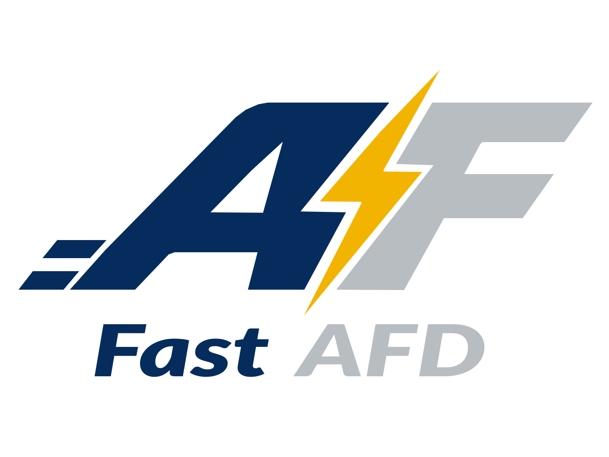
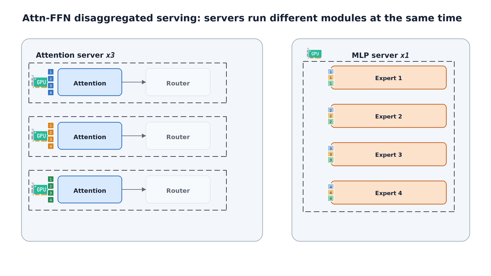
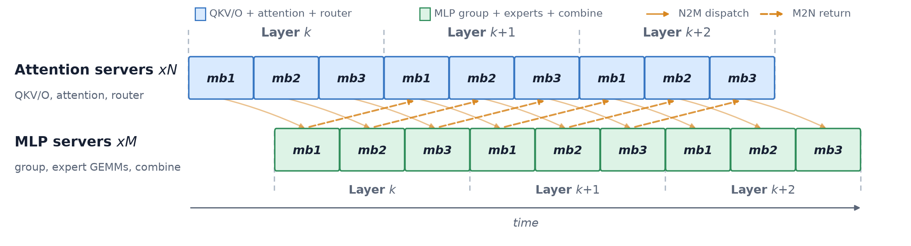
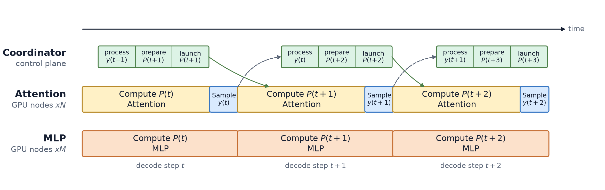
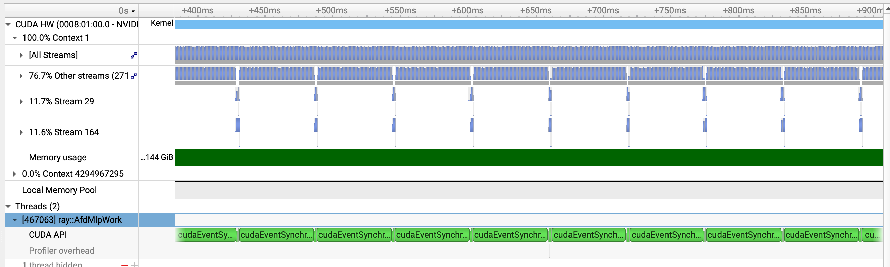
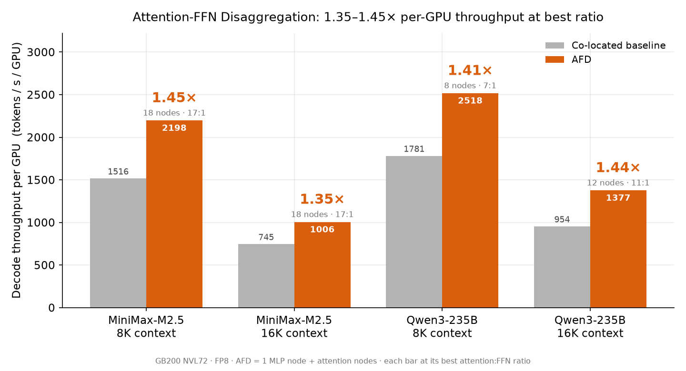

<p align="center">
  <picture>
    <source media="(prefers-color-scheme: dark)" srcset="assets/logo-dark.svg">
    
  </picture>
</p>

<p align="center"><b>Fast Attention–FFN Disaggregation for MoE Serving</b></p>

<p align="center">
| <a href="https://haoailab.com/blogs/fastafd/">Blog</a> | <a href="#">X</a> |
</p>

---

FastAFD is an open-source serving system for **large-scale Attention–FFN Disaggregation (AFD)** of MoE models.

## News

- **[2026-07-07]** FastAFD is open-sourced — **1.3–1.5× per-GPU decode throughput**
  over colocated MoE serving on Blackwell NVL72.

## Contents

- [How FastAFD Works](#how-fastafd-works)
- [Key Techniques](#key-techniques)
  - [N2M/M2N MoE Megakernel](#n2mm2n-moe-megakernel)
  - [Micro-Batch Ping-Pong Overlap](#micro-batch-ping-pong-overlap)
  - [Zero-Overhead Cluster Coordination](#zero-overhead-cluster-coordination)
- [Results](#results)
- [Getting Started](#getting-started)
  - [Install](#install)
  - [Supported Models](#supported-models)
  - [Quickstart](#quickstart)
  - [Correctness Alignment](#correctness-alignment)
  - [Large-Scale AFD Experiments](#large-scale-afd-experiments)
- [Acknowledgements](#acknowledgements)
- [Citation](#citation)

## How FastAFD Works

<p align="center">
  
</p>

FastAFD splits MoE decoding into **attention servers** and **MLP servers**.
Attention servers own KV-cache attention, routing, and sampling; MLP servers
aggregate routed hidden states from many attention servers and run the experts.
Micro-batches overlap dispatch, expert execution, and combine so the MLP side
stays dense while activations move.

## Key Techniques

### N2M/M2N MoE Megakernel

FastAFD maps the AFD boundary to an asymmetric DeepEP-style dispatch/combine
path. During N2M, attention ranks send routed activations and MLP ranks receive
expert inputs; during M2N, MLP ranks return combined outputs and attention ranks
receive layer results. On the MLP side, FastAFD runs the repeated receive, group,
expert, combine, and send-back loop as a role-specialized MoE path with fewer
launches and synchronization points.

### Micro-Batch Ping-Pong Overlap

<p align="center">
  
</p>

FastAFD splits each decode batch into micro-batches so N2M dispatch, expert
execution, M2N return, and attention-side work overlap across layers instead of
serializing at every AFD boundary.

### Zero-Overhead Cluster Coordination

<p align="center">
  
  <br>
  
</p>

FastAFD prepares the next decode plan while GPUs execute the current one. The
coordinator publishes micro-batch order, buffer slots, request ownership, and
peer metadata one step ahead, so scheduling stays off the decode critical path.

## Results

<p align="center">
  
</p>

FastAFD improves per-GPU decode throughput by **1.35–1.45×** over colocated
MoE serving across Qwen3-235B-A22B-FP8 and MiniMax-M2.5 on GB200 NVL72.

## Getting Started

FastAFD is currently validated on `aarch64` with CUDA 13.0. The conda
environment is named `minisgl-cuda130` for compatibility with the current
runtime scripts.

### Install

```bash
conda env create -f environment.cuda130.yml
./scripts/enter_clean.sh minisgl-cuda130
pip install -e .
```

Install vLLM in the same clean shell if you want to run alignment checks:

```bash
python -m pip install \
  "https://github.com/vllm-project/vllm/releases/download/v0.19.0/vllm-0.19.0+cu130-cp38-abi3-manylinux_2_35_aarch64.whl" \
  --extra-index-url https://download.pytorch.org/whl/cu130
```

Then apply the runtime overrides used by the AFD/DeepEP path:

```bash
python -m pip install --no-cache-dir --force-reinstall --no-deps \
  "nvidia-nccl-cu13==2.30.4" \
  "setuptools==80.10.2" \
  "fsspec==2026.2.0"
```

Validated package versions are `torch 2.10.0+cu130`, `triton 3.6.0`,
`nvidia-nccl-cu13 2.30.4`, and `vllm 0.19.0+cu130` when alignment is enabled.

### Supported Models

- Quickstart and correctness: `Qwen/Qwen3-30B-A3B-Instruct-2507`
- Published scaling presets: Qwen3-235B-A22B-FP8 and MiniMax-M2.5-FP8

### Quickstart

```bash
./scripts/quickstart/qwen3_30b_a3b_sample.sh
```

This starts a local mini-sgl server, samples the Qwen3-30B-A3B prompt set, and
writes artifacts under `reports/`.

### Correctness Alignment

```bash
./scripts/validate/qwen3_30b_a3b_alignment.sh
./scripts/validate/qwen3_30b_a3b_fastafd_alignment.sh
```

The first script checks mini-sgl against vLLM (single node, 4 GPUs via the `mp`
backend). The second checks the FastAFD serve path against vLLM and needs a
running Ray cluster with at least 8 GPUs (attention TP 4 + MLP TP 4).

Both alignment commands are thin 30B presets that call one reusable validator,
`scripts/validate/fastafd_vllm_alignment.sh`, which aligns the FastAFD serve path
against vLLM for any model or AFD attention/MLP layout. To validate a different
model or a custom split, call it directly (run with no arguments for the full
option list):

```bash
./scripts/validate/fastafd_vllm_alignment.sh \
  --env minisgl-cuda130 --model <hf-id-or-path> \
  --prompt-file <utf8-prompts.txt> \
  --attn-tp-size 4 --mlp-tp-size 4 --afd-mlp-ep-size 4 \
  --afd-max-running-requests 64 --sample-concurrency 64 \
  --max-new-tokens 64
```

### Large-Scale AFD Experiments

Presets live under `scripts/experiments/afd/` and assume a running Ray GPU cluster,
launched from the activated `minisgl-cuda130` environment. Nodes are
auto-discovered from `RAY_ADDRESS=auto` (last node = MLP, the rest = attention);
on multi-node clusters use a shared local `MODEL_PATH` snapshot to avoid
per-rank Hugging Face cache resolution.

The 512-prompt long-context caches ship under `prompts/`. Regenerate them only
if needed (the 16K cache uses `--target-tokens 16384` and adds `--min-source-tokens 20000`):

```bash
PYTHONPATH=python python scripts/data_gen/generate_realistic_long_prompts.py \
  --model Qwen/Qwen3-235B-A22B-FP8 --target-tokens 8192 --count 512 \
  --output prompts/prompts_512x8192_seed20260527.txt --seed 20260527
```

Run a preset (minimal 4-node, no vLLM scoring or Nsight profiling):

```bash
MODEL_PATH=/path/to/Qwen3-235B-A22B-FP8 AFD_TOTAL_NODES=4 \
RUN_VLLM_ALIGNMENT=0 NSYS=0 \
bash scripts/experiments/afd/qwen3_235b/run_afd_qwen3_235b_a22b_fp8_8k_b96_dynamicnode_mb2_nsys_alignment.sh
```

Optional environment knobs:

| Env var | Effect |
|---|---|
| `MODEL_PATH` | Local weight snapshot (recommended for multi-node; required offline, e.g. MiniMax-M2.5). |
| `AFD_NODE_LIST` / `AFD_MLP_NODE` | Explicit node placement instead of Ray auto-discovery (e.g. `node0,node1,node2,node3` / `node3`). |
| `RUN_VLLM_ALIGNMENT=1` | Cross-check FastAFD outputs against an expert-parallel vLLM baseline (see below). |
| `NSYS=1` + `MINISGL_RAY_NSYS_BIN=/path/to/nsys` | Capture Nsight Systems traces. |

Available presets:

| Model | Context | Default workload | Script |
|---|---:|---|---|
| Qwen3-235B-A22B-FP8 | 8K | 96 requests / attention GPU | `scripts/experiments/afd/qwen3_235b/run_afd_qwen3_235b_a22b_fp8_8k_b96_dynamicnode_mb2_nsys_alignment.sh` |
| Qwen3-235B-A22B-FP8 | 16K | 48 requests / attention GPU | `scripts/experiments/afd/qwen3_235b/run_afd_qwen3_235b_a22b_fp8_16k_b48_dynamicnode_mb2_nsys_alignment.sh` |
| MiniMax-M2.5-FP8 | 8K | 72 requests / attention GPU | `scripts/experiments/afd/minimax_m25/run_afd_minimax_m25_fp8_8k_b72_dynamicnode_mb2_nsys_alignment.sh` |
| MiniMax-M2.5-FP8 | 16K | 36 requests / attention GPU | `scripts/experiments/afd/minimax_m25/run_afd_minimax_m25_fp8_16k_b36_dynamicnode_mb2_nsys_alignment.sh` |

Reusable OCI-HSG single-case, same-tray sweep, corrected CUDA-metric, and
wide-EP baseline controls live under `scripts/experiments/afd/oci_hsg/`; see
that directory's README for the required task-workspace inputs and provenance
checks. Generated plans, manifests, logs, traces, and results are intentionally
kept outside the source tree.

**vLLM cross-check (`RUN_VLLM_ALIGNMENT=1`).** Scores through an expert-parallel
vLLM baseline (`--all2all-backend deepep_low_latency --moe-backend deep_gemm`),
which needs two optional kernel packages in the same environment: `deep_ep`
(all-to-all dispatch/combine) and `deep_gemm` (FP8 grouped-GEMM experts — vLLM
only enables its `BATCHED_DEEPGEMM` MoE backend when `import deep_gemm` succeeds,
otherwise the engine fails to start). Install both via vLLM's
[`tools/ep_kernels`](https://github.com/vllm-project/vllm/blob/main/tools/ep_kernels/README.md),
or build `deep_gemm` from source (`pip install --no-deps .` in a
[DeepGEMM](https://github.com/deepseek-ai/DeepGEMM) clone). Both are independent
of the FastAFD serve path, which uses its own vendored kernels. On memory-tight
nodes, lower `--gpu-memory-utilization` (e.g. to `0.85`) via `VLLM_EXTRA_ARGS`
to avoid OOM during CUDA-graph capture.

Each preset prints the selected topology and output directory at startup. See
`scripts/README.md` for the full script map.

## Acknowledgements

FastAFD started from a [mini-sglang](python/minisgl) serving codebase inspired by
[SGLang](https://github.com/sgl-project/sglang), and builds on ideas and
components from the broader open-source LLM systems community, including
[DeepEP](https://github.com/deepseek-ai/DeepEP),
[DeepGEMM](https://github.com/deepseek-ai/DeepGEMM),
[vLLM](https://github.com/vllm-project/vllm).

## Citation

If you find FastAFD useful, please cite:

```bibtex
@misc{fastafd2026,
  title  = {FastAFD: Open-Source Large-Scale Attention-FFN Disaggregation on Blackwell NVL72},
  author = {Fu, Yichao and Zhang, Yuxuan and Wang, Ruitian and Chen, Junda and Zhang, Hao},
  year   = {2026},
  url    = {https://github.com/hao-ai-lab/FastAFD},
  note   = {Technical blog and open-source release}
}
```
